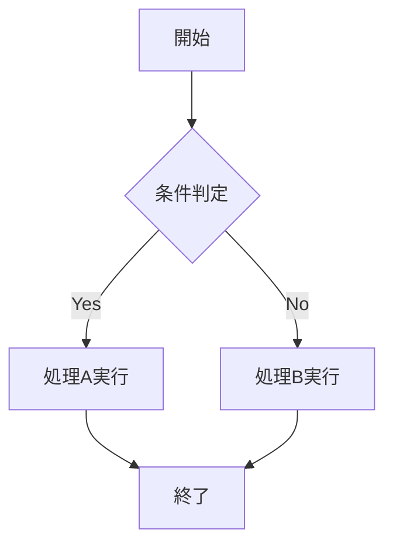
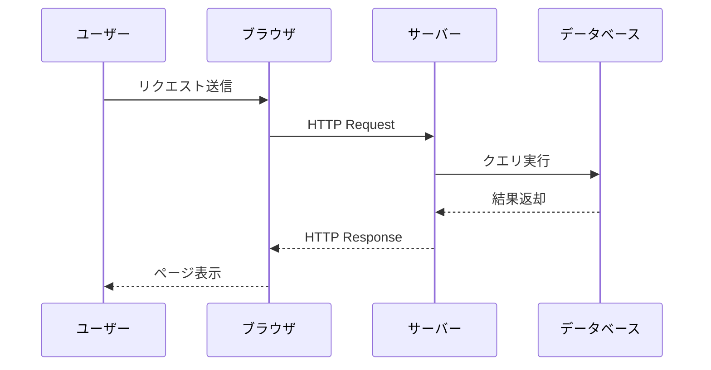
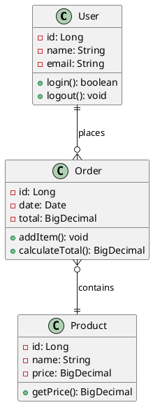
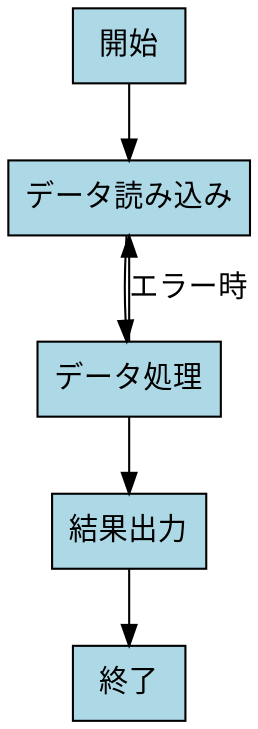

# Markdown Preview Enhanced サンプルドキュメント

この文書は md2pdf コンバーターと Markdown Preview Enhanced 機能の包括的なテスト用サンプルです。

## 📝 基本的なテキスト装飾

### 強調表現
- **太字テキスト**
- *斜体テキスト*
- ***太字斜体***
- ~~取り消し線~~
- ==ハイライト==
- `インラインコード`

### リスト
#### 番号なしリスト
- 項目 1
- 項目 2
  - サブ項目 2.1
  - サブ項目 2.2
    - サブサブ項目 2.2.1

#### 番号付きリスト
1. 最初の項目
2. 二番目の項目
3. 三番目の項目

#### タスクリスト
- [x] 完了済みタスク
- [ ] 未完了タスク
- [ ] 別の未完了タスク

## 💻 コードブロック（シンタックスハイライト）

### JavaScript
```javascript
function fibonacci(n) {
    if (n <= 1) return n;
    return fibonacci(n - 1) + fibonacci(n - 2);
}

console.log("フィボナッチ数列:", fibonacci(10));
```

### Python
```python
def quicksort(arr):
    if len(arr) <= 1:
        return arr
    pivot = arr[len(arr) // 2]
    left = [x for x in arr if x < pivot]
    middle = [x for x in arr if x == pivot]
    right = [x for x in arr if x > pivot]
    return quicksort(left) + middle + quicksort(right)

print(quicksort([3, 6, 8, 10, 1, 2, 1]))
```

### SQL
```sql
SELECT 
    u.name,
    COUNT(o.id) as order_count,
    SUM(o.total) as total_spent
FROM users u
LEFT JOIN orders o ON u.id = o.user_id
WHERE u.created_at >= '2024-01-01'
GROUP BY u.id, u.name
ORDER BY total_spent DESC;
```

## 📊 数式（KaTeX LaTeX）

### インライン数式
円の面積は $A = \pi r^2$ で計算できます。

### ブロック数式
$$
E = mc^2
$$

$$
\frac{d}{dx}\int_a^x f(t)dt = f(x)
$$

$$
\sum_{i=1}^{n} i = \frac{n(n+1)}{2}
$$

$$
\begin{pmatrix}
a & b \\
c & d
\end{pmatrix}
\begin{pmatrix}
x \\
y
\end{pmatrix}
=
\begin{pmatrix}
ax + by \\
cx + dy
\end{pmatrix}
$$

## 📋 テーブル

### 基本テーブル
| 名前 | 年齢 | 職業 | 都市 |
|------|------|------|------|
| 田中太郎 | 30 | エンジニア | 東京 |
| 佐藤花子 | 25 | デザイナー | 大阪 |
| 山田次郎 | 35 | マネージャー | 名古屋 |

### 整列指定付きテーブル
| 項目 | 価格（円） | 評価 |
|:-----|----------:|:----:|
| ノートPC | 120,000 | ⭐⭐⭐⭐⭐ |
| マウス | 3,500 | ⭐⭐⭐⭐ |
| キーボード | 15,000 | ⭐⭐⭐⭐⭐ |

## 📈 図表とダイアグラム

### Mermaid フローチャート


### Mermaid シーケンス図


### Mermaid ガントチャート
```mermaid
gantt
    title プロジェクトスケジュール
    dateFormat  YYYY-MM-DD
    section 設計フェーズ
    要件定義           :a1, 2024-01-01, 30d
    基本設計           :after a1, 20d
    section 開発フェーズ
    フロントエンド開発  :2024-02-20, 45d
    バックエンド開発    :2024-02-20, 60d
    section テストフェーズ
    単体テスト         :2024-04-15, 15d
    統合テスト         :after 単体テスト, 10d
```

### PlantUML クラス図


### GraphViz DOT


## 🔗 リンクと画像

### リンク
- [Google](https://www.google.com)
- [GitHub](https://github.com)
- [参照リンク][1]

[1]: https://www.example.com "参照リンクの例"

### 画像（プレースホルダー）


## 📜 引用

> これは単一行の引用です。

> これは複数行の引用です。
> 引用の二行目。
> 
> > ネストした引用
> > 
> > さらにネストした内容

## 🧮 特殊記法

### 脚注
これは脚注付きのテキストです[^1]。

[^1]: これは脚注の内容です。

### 区切り線
---

### 絵文字
:smile: :heart: :thumbsup: :rocket: :computer: :books:

### エスケープ文字
\*これは斜体にならない\*
\`これはコードにならない\`

## 🎨 HTMLの埋め込み

<div style="background-color: #f0f8ff; padding: 20px; border-radius: 10px; border: 2px solid #0066cc;">
    <h4 style="color: #0066cc;">HTML埋め込みの例</h4>
    <p>HTMLタグを直接使用することも可能です。</p>
    <button onclick="alert('Hello!')">クリックしてみて</button>
</div>

## 📊 高度なテーブル（HTML）

<table>
<thead>
    <tr>
        <th rowspan="2">項目</th>
        <th colspan="2">2023年</th>
        <th colspan="2">2024年</th>
    </tr>
    <tr>
        <th>Q1</th>
        <th>Q2</th>
        <th>Q1</th>
        <th>Q2</th>
    </tr>
</thead>
<tbody>
    <tr>
        <td>売上</td>
        <td>100</td>
        <td>120</td>
        <td>130</td>
        <td>150</td>
    </tr>
    <tr>
        <td>利益</td>
        <td>20</td>
        <td>25</td>
        <td>30</td>
        <td>35</td>
    </tr>
</tbody>
</table>

## 🧪 コード実行（Code Chunk）

### Python計算例
```python {cmd=true}
import math

# 円周率の計算
def calculate_pi(n):
    pi = 0
    for i in range(n):
        pi += ((-1) ** i) / (2 * i + 1)
    return 4 * pi

result = calculate_pi(1000)
print(f"π ≈ {result:.6f}")
```

## 📋 まとめ

この文書では、Markdown Preview Enhanced が対応している主要機能を網羅的に示しました：

1. **基本的なMarkdown記法** - 強調、リスト、コードブロック
2. **数学表現** - KaTeX による LaTeX 数式サポート  
3. **図表生成** - Mermaid、PlantUML、GraphViz
4. **高度な機能** - HTMLの埋め込み、脚注、絵文字
5. **対話的要素** - Code Chunk による実行可能コード

このサンプルを使用して、md2pdf コンバーターの変換品質とMarkdown Preview Enhanced との互換性を確認できます。
